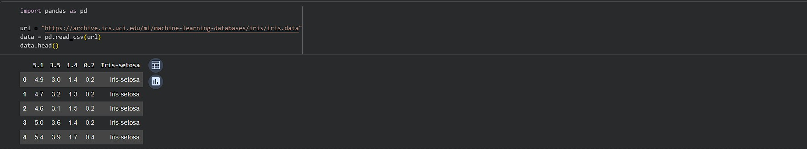
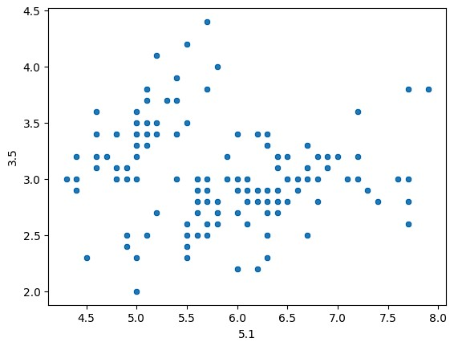

# Iris-Data-Analysis-Project
This repository contains a simple data analysis project using the Iris dataset. We performed a quick exploration and created a visualization to understand the data using python.

## Project Steps

1. Loading the Dataset: We loaded the Iris dataset from the UCI Machine Learning Repository.

   Below is the code used to import pandas and load the Iris dataset from UCI:

   

2. Data Summary: We used pandas to generate summary statistics of the dataset.

3. Visualization: We created a scatter plot to visualize the relationship between sepal length and sepal width.

## Visualization
Below is the scatter plot we generated:
 

## How to Run

1. Clone this repository to your local machine.

2. Make sure you have Python and the necessary libraries (pandas, seaborn, matplotlib) installed.

3. Run the Jupyter Notebook or Python script to see the analysis and visualization.

Feel free to explore and modify the code!
